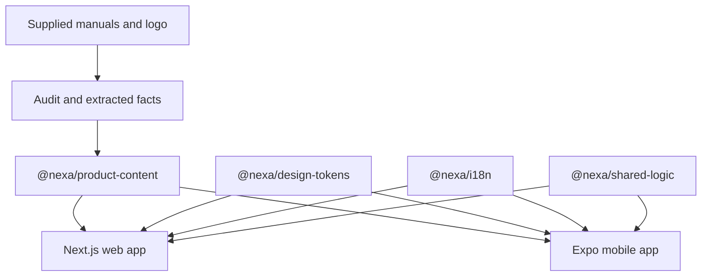

# Architecture

## Dependency flow

## Runtime boundaries

The product apps contain no backend and no hardware-control channel. Progress, locale, and model selection are device-local. Web uses `localStorage`; mobile uses AsyncStorage.

The product content package is the source of truth for:

- model verification status
- lesson order and bilingual titles
- settings and fault code collections
- model-specific specifications
- anatomy and wiring facts
- source document metadata
- troubleshooting decisions

Zod parses product model records at module load. Invalid source content fails during tests, content validation, type checking, or application build.

## Web

- Next.js 16 App Router
- standalone production output
- responsive routes for language, models, academy, and individual lessons
- shadcn-style Radix primitives
- local font packages
- public static PDFs, diagrams, logo, and product images

## Mobile

- Expo SDK 57
- Expo Router
- React Native new architecture enabled
- Android and iOS identifiers configured
- EAS development, preview, and production profiles
- local fonts and bundled images
- device-local learning progress

## Safety architecture

No route or component can mutate inverter settings or connect to hardware. The LCD surface is explicitly a teaching simulator. Troubleshooting decisions terminate in safe observation or escalation.
