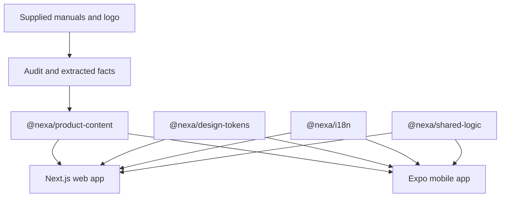

# Architecture

## Dependency flow

```mermaid
flowchart TD
  S["Supplied manuals and logo"] --> A["Audit and extracted facts"]
  A --> P["@nexa/product-content"]
  P --> W["Next.js web app"]
  P --> M["Expo mobile app"]
  T["@nexa/design-tokens"] --> W
  T --> M
  I["@nexa/i18n"] --> W
  I --> M
  L["@nexa/shared-logic"] --> W
  L --> M
```

## Runtime boundaries

The product apps contain no backend and no hardware-control channel. Progress, locale, and model selection are device-local. Web uses `localStorage`; mobile uses AsyncStorage.

The product content package is the source of truth for:

- model verification status
- lesson order and bilingual titles
- settings and fault code collections
- model-specific specifications
- anatomy and wiring facts
- source document metadata
- troubleshooting decisions

Zod parses product model records at module load. Invalid source content fails during tests, content validation, type checking, or application build.

## Web

- Next.js 16 App Router
- standalone production output
- responsive routes for language, models, academy, and individual lessons
- shadcn-style Radix primitives
- local font packages
- public static PDFs, diagrams, logo, and product images

## Mobile

- Expo SDK 57
- Expo Router
- React Native new architecture enabled
- Android and iOS identifiers configured
- EAS development, preview, and production profiles
- EAS Update (`expo-updates`) with an offline-first policy: `ON_LOAD` checks never block launch, and the `appVersion` runtime version policy keeps OTA updates inside a single native release
- adaptive UI layer (`src/ui/`): shared brand tokens and logic, platform-split controls — iOS follows HIG (dim feedback, 12pt radius, chevron back), Android follows Material 3 (ripple, stadium shape, outlined ghost, arrow back); rules in `docs/PLATFORM_UI.md`
- sourced sizing calculator (`app/calculator.tsx`): device limits are extracted at import time from the verified `specifications` rows (`deviceLimits`), so any content drift throws instead of silently mis-advising; the pure math engine lives in `@nexa/shared-logic/src/sizing.ts` with vitest coverage that locks the sourced numbers
- crash telemetry: `@sentry/react-native` wired behind a dormant DSN contract (`extra.sentry.dsn`); nothing is sent until configured and it is disabled in development
- content-error feedback strip on every screen (mailto/Telegram), dormant until contact constants are filled
- field-tool screens, all JS and OTA-deliverable: academy lesson list with review progress (`app/academy/[slug].tsx`), menu-accurate LCD simulator driven by the real 31-program table (`components/lesson/lcd-simulator.tsx`), sourced knowledge-check bank (`quizBank` + `components/lesson/quiz-lesson.tsx`), global search plus a fault-code quick grid (`app/search.tsx`), and an offline commissioning checklist persisted in AsyncStorage without any account (`app/checklist.tsx`)
- local fonts and bundled images
- device-local learning progress

## Safety architecture

No route or component can mutate inverter settings or connect to hardware. The LCD surface is explicitly a teaching simulator. Troubleshooting decisions terminate in safe observation or escalation.
